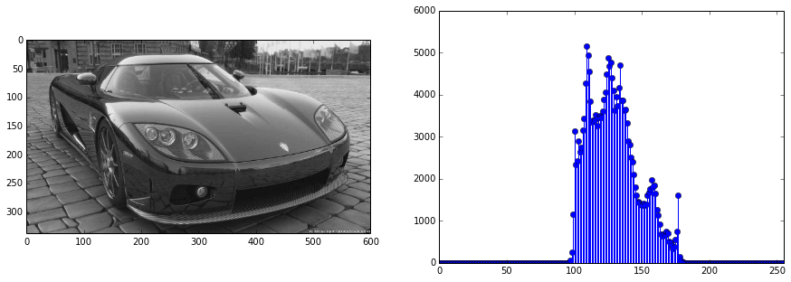
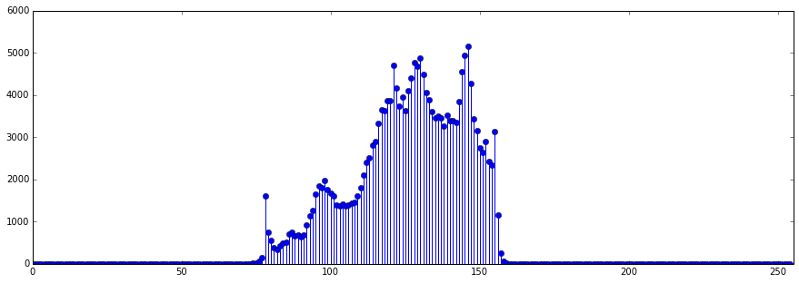
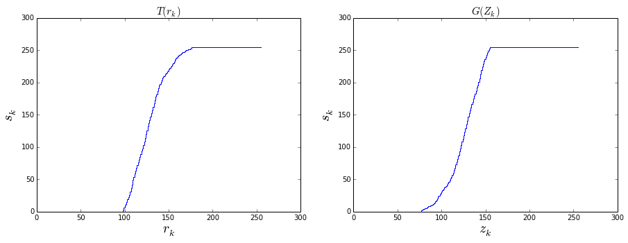
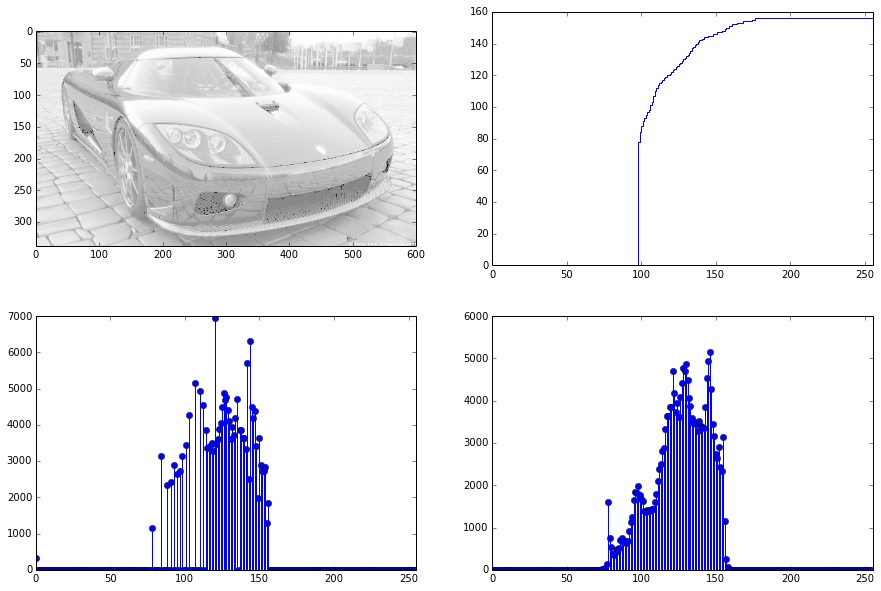

---
# You don't need to edit this file, it's empty on purpose.
# Edit theme's home layout instead if you wanna make some changes
# See: https://jekyllrb.com/docs/themes/#overriding-theme-defaults
layout: default
title: Homework 2
permalink: /homeworks/HOMEWORK02
---


# HOMEWORK02

Histogram equalization is an important operation in image processing. It is mostly used for image enhancement and image segmentation.

In this homework you will take an input image and perform histogram equalization operation to this image. First open read and plot the image and its histogram side by side to the screen. It should look like this:

Your program should perform a transformation which we call histogram specification. The specified histogram is defined as Equation \ref{eq:specified}:

\begin{equation}
p_z(z_k)=p_r(L-1-r_k)\label{eq:specified}
\end{equation}

According to this definition find the specified histogram and plot it accordingly. In your homework report clearly explain how you find the specified histogram. How do you read/can you interpret the definition in Equation \ref{eq:specified}. If we consider the above histogram specified histogram should look like this:

If we recall the histogram specification method; we have to define two transformations $$T$$ and $$G$$ for both input (source) and output (target) images respectively. $$T$$ and $$G$$ are nothing but histogram equalization operations given as:

$$s_k = T(r_k) = (L-1) \sum_{j=0}^k p_r(r_j)$$
\\
$$s_k = G(z_k) = (L-1) \sum_{i=0}^k p_z(z_i)$$

For both input and output images we can find $$T$$ and $$G$$ by using $$p_r$$ and $$p_z$$ values. Calculate and plot $T$ and $G$ side by side. For the above histograms the plots should like the following, plot titles axis names should be given correctly!

Next, you should find the  transformation which is defined between $$r_k$$ and $$z_k$$. Use this transformation to transform the whole input image then plot the new image, the transformation function, new image histogram and the specified histogram you calculated above and make your comments about the results you obtained.

# HOMEWORK SUBMISSION GUIDELINE:

The homework submission guideline is of grave importance for this course. Improper submissions will not be graded!.

 - Rename your ipynb file accordingly. It should both indicate your student number (lets assume it is 12345678) and the corresponding homework number (lets assume it is homework 2). Hence the file should be renamed as **12345678HW02.ipynb** (Beware of the capital HW letters!)
 - You will submit your homework by mailing it to **ikcumee404@gmail.com** address. The subject of your mail should also be named accordingly. It contain course number (MEE404), the homework number (lets assume it is homework 2) and your student number (lets assume it is 12345678). Hence the subject field of your submission mail should be  MEE404 HW02 12345678 (each separated by a single space!)
 - Co-operation is strongly prohibited!
 - Try to submit before the announced deadline or 25 pts. will be taken off for the next day.
 - Homeworks submitted later than one day will not be graded.
