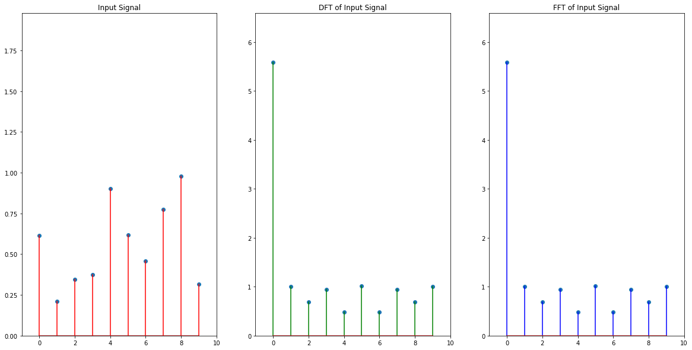
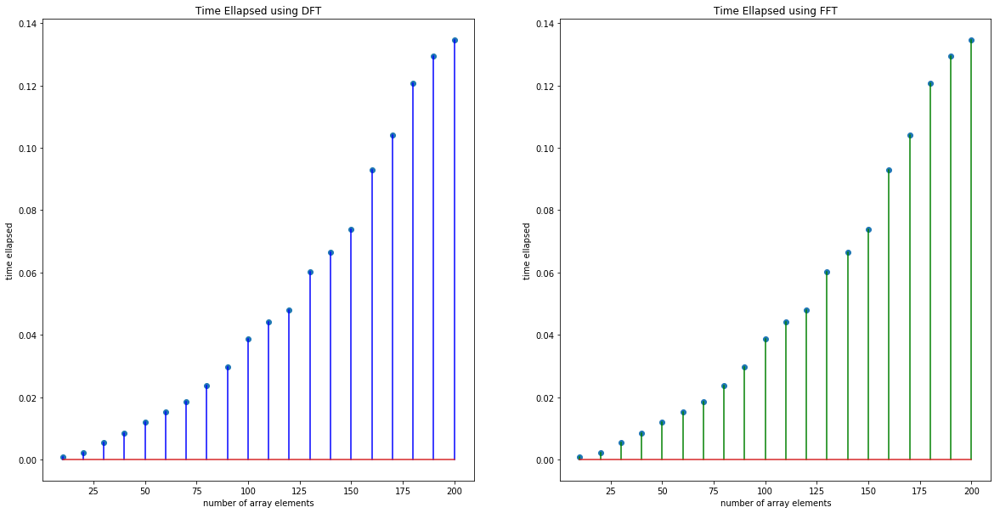

---
# You don't need to edit this file, it's empty on purpose.
# Edit theme's home layout instead if you wanna make some changes
# See: https://jekyllrb.com/docs/themes/#overriding-theme-defaults
layout: default
title: Homework 4
permalink: /homeworks/HOMEWORK04
---


# HOMEWORK04 (Deadline 30.04.2018 23:59:59)

* Explain 1D Discrete Fourier Transform in your own words.
* Implement your own Discrete Fourier Transformation function.
* Create a random array with numpy.random.rand() function this will be your $$f[n]$$
* Find DFT of $$f[n]$$ by using your function this will be your $$F[m]$$
* Also use numpy.fft.fft() function to find $$F[m]$$
* Plot $$f[n]$$ , $$F[m]$$ you found by using your  DFT implementation and $$F[m]$$ you found by using numpy.fft.fft.\(\) side by side.
* Since $$F[m]$$ consists of complex numbers you will be actually plotting $$\|F[m]\|$$.

The result should look like the following, your implementation and numpy fft function give the same result.

* Compare the performance of your function with fft function from numpy library. And plot a graph showing this comparison.
* Your criteria will be the time ellapsed.
* x axis will be the number of elements in $f[n]$
* y axis will be the time ellapsed.
* Test for 10,20,30,40,....,190,200 elements
* You can measure time by using pythons time library.

The result should look like the following plot:

_(CAREFUL! this is only to show you the placement of plots and axis labeling, the result for two case will be much different)_

* Comment on the results? Which function is faster?
* What is FFT? How does it work? Explain briefly.
